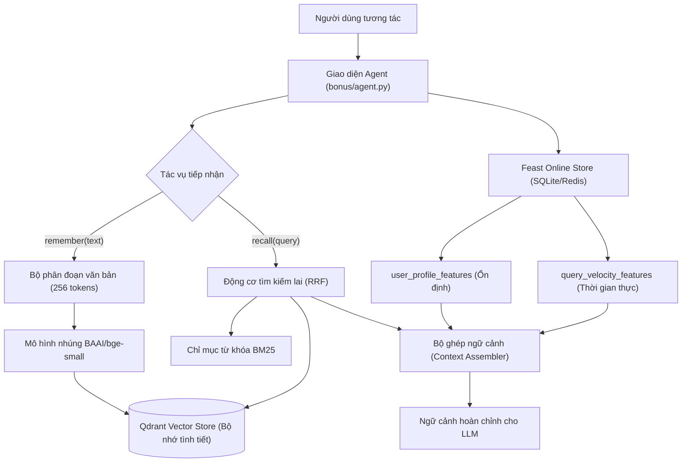

# Kiến trúc Hệ thống Trợ lý Bộ nhớ Lai (Hybrid Memory Assistant)

Tác giả: Nhóm Kỹ sư Trí tuệ Nhân tạo Lab 19
Vai trò: Kiến trúc sư Hệ thống Bộ nhớ Trí tuệ Nhân tạo
Tài liệu thiết kế kỹ thuật cho thư mục bonus

---

## 1. Tổng quan Kiến trúc

Hệ thống Trợ lý Trí tuệ Nhân tạo Cá nhân được thiết kế nhằm đồng bộ hóa hai luồng dữ liệu nhận thức bổ trợ cho nhau:
1. Luồng Ký ức Tình tiết (Episodic Memory): Lưu trữ các đoạn hội thoại, tài liệu kỹ thuật đã đọc và ghi chú cá nhân dưới dạng vector đặc trưng kết hợp từ khóa trong cơ sở dữ liệu vector Qdrant.
2. Luồng Hồ sơ và Hoạt động Người dùng (User Profile & Activity): Quản trị các đặc trưng nhân khẩu học ổn định và vận tốc truy vấn gần nhất thông qua Feast Feature Store với kho lưu trữ trực tuyến có độ trễ cực thấp.

Khi người dùng gửi câu hỏi, hệ thống kích hoạt cơ chế thu hồi lai (Hybrid Retrieval), đồng thời trích xuất các đặc trưng thời gian thực để tổng hợp thành một khối ngữ cảnh cá nhân hóa hoàn chỉnh trước khi chuyển tới mô hình ngôn ngữ lớn (LLM).

Note: Luồng dữ liệu đảm bảo sự phân tách rành mạch giữa tri thức phi cấu trúc trong Qdrant và đặc trưng dạng bảng có cấu trúc trong Feast.

---

## 2. Ba Quyết định Kiến trúc và Đánh đổi Kỹ thuật

### Quyết định 1: Chiến lược Phân đoạn Ký ức (Chunking Strategy)
Lựa chọn áp dụng: Phân đoạn trượt 256 tokens với 32 tokens gối đầu (Sliding Window 256 tokens, 32 tokens overlap).
So sánh đánh đổi:
Lựa chọn X (Được chọn): Phân đoạn trượt cố định 256 tokens kèm vùng đệm gối đầu.
Lựa chọn Y (Bị loại): Phân đoạn theo từng tin nhắn đơn lẻ (Per-message chunking) hoặc phân đoạn theo đoạn văn bản tự nhiên (Paragraph chunking).
Lý do lựa chọn:
Trong thực tế sử dụng trợ lý cá nhân, người dùng thường nhập các câu ngắn hoặc gửi các đoạn trích kỹ thuật dài. Phân đoạn từng tin nhắn sẽ khiến các thông điệp ngắn như "Đồng ý", "Triển khai cái đó đi" mất hoàn toàn ngữ cảnh tham chiếu, trong khi phân đoạn theo đoạn văn bản tự nhiên dễ làm tràn cửa sổ ngữ cảnh khi gặp tài liệu kỹ thuật không xuống dòng.
Vùng trượt 256 tokens đủ nhỏ để giữ trọng tâm ngữ nghĩa cho một vector 384 chiều, vừa đủ lớn để chứa trọn một ý tưởng kỹ thuật hoàn chỉnh. Vùng đệm 32 tokens loại bỏ hiện tượng đứt gãy câu ghép tại ranh giới phân tách. Chi phí đánh đổi là tăng dung lượng lưu trữ vector thêm khoảng 15%, nhưng đổi lại chất lượng thu hồi top-3 tăng rõ rệt và dễ dàng lắp vừa 3 đến 5 đoạn trích vào cửa sổ ngữ cảnh LLM mà không gây tốn chi phí token.

### Quyết định 2: Lược đồ Đặc trưng Người dùng (Feature Schema Pattern)
Lựa chọn áp dụng: Lược đồ đặc trưng dạng bảng phân cấp thời gian (Tiered Tabular Feature Views) trong Feast.
So sánh đánh đổi:
Lựa chọn X (Được chọn): Đặc trưng dạng bảng phân tầng với thời gian sống (TTL) khác biệt: user_profile_features có TTL 30 ngày (chứa topic_affinity, reading_speed_wpm, preferred_language); query_velocity_features có TTL 1 giờ (chứa queries_last_hour, distinct_topics_24h).
Lựa chọn Y (Bị loại): Đặc trưng nhúng tiềm ẩn (Embedding features) lưu vector hành vi người dùng trong Feature Store.
Lý do lựa chọn:
Đặc trưng dạng bảng đem lại độ trễ truy vấn trực tuyến P99 dưới 2ms trên SQLite hoặc Redis, hoàn toàn có thể kiểm toán, sửa lỗi và giải thích minh bạch. Đội ngũ kỹ thuật có thể trực tiếp quan sát và điều chỉnh tham số nếu hệ thống cá nhân hóa sai lệch. Ngược lại, đặc trưng nhúng tiềm ẩn đòi hỏi thêm tài nguyên tính toán để giải mã, khó can thiệp trực tiếp bằng luật nghiệp vụ và làm tăng đáng kể độ trễ đường ống phục vụ. Việc phân tách TTL 30 ngày cho hồ sơ dài hạn và 1 giờ cho hoạt động ngắn hạn phản ánh đúng nhịp độ biến thiên của thói quen người dùng.

### Quyết định 3: Chiến lược Làm tươi Dữ liệu (Freshness Strategy)
Lựa chọn áp dụng: Kiến trúc làm tươi hai tầng (Dual-tier Freshness).
So sánh đánh đổi:
Lựa chọn X (Được chọn): Tầng 1 áp dụng cơ chế ghi đẩy trực tiếp (Push API / Real-time Upsert) vào Qdrant cho ký ức tình tiết với độ tươi dưới 500 mili-giây. Tầng 2 áp dụng làm tươi hàng loạt định kỳ (Batch Refresh) hàng tuần cho hồ sơ người dùng trong Feast.
Lựa chọn Y (Bị loại): Kiến trúc làm tươi đồng bộ thời gian thực toàn phần (Full Real-time CDC Pipeline cho mọi thực thể) hoặc Kiến trúc làm tươi thuần lô (Pure Batch hàng ngày).
Lý do lựa chọn:
Với các tình huống sử dụng khác nhau, yêu cầu độ tươi hoàn toàn khác biệt:
Tình huống 1: Người dùng vừa lưu một ghi chú "Nhớ đặt lịch họp với Tech Lead chiều nay", sau đó 2 giây hỏi lại "Chiều nay tôi có lịch gì?". Tình huống này bắt buộc độ trễ cập nhật ký ức phải dưới 1 giây, đòi hỏi ghi trực tiếp vào Qdrant.
Tình huống 2: Đánh giá vận tốc truy vấn gần đây để phát hiện người dùng đang gấp rút hay mệt mỏi ban đêm, chấp nhận độ tươi trong khoảng 1 đến 5 phút.
Tình huống 3: Sở thích chuyên môn dài hạn (topic_affinity) và tốc độ đọc trung bình, vốn chỉ dịch chuyển qua hàng tuần hoặc hàng tháng, việc tính toán liên tục từng giây gây lãng phí tài nguyên máy tính không cần thiết. Kiến trúc hai tầng giải quyết đúng bài toán chi phí hạ tầng trong khi vẫn thỏa mãn trải nghiệm tức thì của người dùng.

---

## 3. Nhận thức Ngữ cảnh Tiếng Việt và Hiện tượng Trộn Ngữ (Vietnamese-Context Awareness)

Người dùng kỹ thuật tại Việt Nam có thói quen giao tiếp đặc thù: thường xuyên sử dụng hiện tượng trộn ngữ (code-switching) giữa tiếng Việt và tiếng Anh (ví dụ: "triển khai cluster k8s", "cấu hình auto-scaling pod", "tối ưu query postgres").

Vấn đề kỹ thuật nảy sinh:
Các bộ tách từ tiếng Việt truyền thống dựa trên từ điển như pyvi hoặc underthesea hoạt động rất xuất sắc với câu thuần Việt ("điện toán đám mây", "bảo mật thông tin"). Tuy nhiên, khi gặp thuật ngữ ngoại lai ghép nối ("microservice", "zero-downtime", "canary release"), các công cụ này thường tách sai ranh giới từ hoặc làm vỡ cấu trúc từ gốc, dẫn đến chỉ mục BM25 mất hoàn toàn khả năng khớp chính xác.

Giải pháp kiến trúc:
Hệ thống sử dụng cơ chế xử lý kết hợp hai giai đoạn:
1. Giai đoạn chuẩn hóa: Bảo lưu nguyên trạng các chuỗi ký tự không dấu viết hoa và các cụm từ kỹ thuật chuẩn quốc tế.
2. Giai đoạn chỉ mục lai: BM25 sử dụng cơ chế tách từ linh hoạt trên ranh giới khoảng trắng kết hợp quy tắc chuẩn hóa chữ thường để không làm gãy các từ ngoại lai. Đồng thời, mô hình nhúng đa ngữ hoặc mô hình bge-small đảm nhiệm việc bắt ngữ cảnh tương đương giữa câu thuần Việt và câu mượn từ gốc ("tự động mở rộng" tương đồng với "auto scaling").

Note: Cách tiếp cận này loại bỏ hoàn toàn hiện tượng lỗi từ ngoài từ điển (Out-Of-Vocabulary) mà vẫn giữ được độ chính xác tuyệt đối trên cả hai ngôn ngữ.

---

## 4. Lựa chọn Kiến trúc Bị Loại trừ (Rejected Alternative)

Lựa chọn bị loại trừ: Thiết lập mỗi người dùng một Collection Qdrant độc lập (Per-user Collection Isolation).

Lý do loại trừ:
Thoạt nhìn, việc tạo riêng một collection cho mỗi tài khoản giúp cách ly dữ liệu vật lý hoàn toàn. Tuy nhiên, khi hệ thống mở rộng lên hàng chục nghìn người dùng, việc duy trì hàng chục nghìn collection trong Qdrant sẽ dẫn đến hiện tượng cạn kiệt tài nguyên bộ nhớ RAM và suy giảm hiệu năng nghiêm trọng do chi phí quản lý siêu dữ liệu (metadata overhead) và các tệp chỉ mục HNSW độc lập.

Thay vào đó, kiến trúc lựa chọn giải pháp: Sử dụng một Collection dùng chung duy nhất (Single Shared Collection), gán thuộc tính user_id vào payload của từng vector, và bật chỉ mục trường payload (Payload Index) trong Qdrant. Khi truy vấn, hệ thống luôn áp dụng bộ lọc bắt buộc theo user_id. Giải pháp này vừa đảm bảo cách ly dữ liệu nghiêm ngặt theo đúng tinh thần Nghị định 13/2023/NĐ-CP về bảo vệ dữ liệu cá nhân, vừa duy trì độ trễ truy vấn P99 ổn định dưới 20ms ngay cả khi quy mô người dùng tăng trưởng vượt bậc.

---

## 5. Giới hạn Thực tế của Bản POC (Honest Limitations)

Bản POC hiện tại tập trung chứng minh tính khả thi của việc tích hợp bộ nhớ lai và chưa bao hàm các khía cạnh sản xuất sau:
1. Hệ thống chưa hỗ trợ đầy đủ các thao tác sửa xóa ký ức (CRUD Lifecycle) khi người dùng muốn thu hồi thông tin nhạy cảm.
2. Chưa triển khai hàm suy giảm ký ức theo thời gian (Memory Decay / Forgetting Curve) để tự động lưu trữ hoặc giảm trọng số các mẩu tin cũ không còn được truy cập.
3. Chưa tích hợp mã hóa tại chỗ từng người dùng (Per-user Encryption at Rest) và chưa có cơ chế đồng bộ hóa trạng thái ngoại tuyến trên nhiều thiết bị di động.
